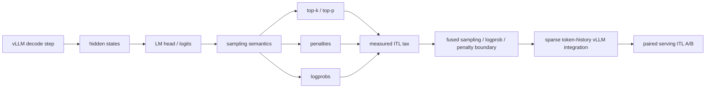

# Single-GPU Inference Lab

[](https://github.com/Kevin-Li-2025/single-gpu-inference-lab/actions/workflows/ci.yml)

Evidence-driven LLM inference systems research for single-card serving.

This repository studies where low-level inference optimizations actually matter
once they are placed inside a real serving stack. The primary target is the
NVIDIA L20 because its 48 GB GDDR6 memory system exposes bottlenecks that HBM
GPUs often hide, but the repo now keeps A100 cross-checks for portability and
claim discipline.

The short version:

> Single-GPU Inference Lab is a research workspace for vLLM, FlashInfer,
> Triton, CUDA, and single-GPU decode serving. It keeps both wins and negative
> results, then uses them to decide the next kernel boundary.

It is not a replacement for vLLM, FlashInfer, TensorRT-LLM, PEFT, TRL, or
Megatron-LM. The useful output is the measured boundary between microkernel
speedups, integration behavior, and end-to-end token latency.

## What This Repo Proves

- Modern vLLM greedy/no-penalty decode is already hard to beat.
- Sampling semantics add a measurable 37%-42% median ITL tax in the current
  A100 control run.
- A fused top-k/top-p + dense-penalty primitive shows 1.36x-1.42x microbenchmark
  speedup on the matching A100 shapes.
- A sparse token-history version keeps 1.27x-1.31x microbenchmark speedup
  versus apply-then-sample without assuming dense `[batch, vocab]` counts.
- A real A100 vLLM serving A/B now shows the opt-in sparse token-history sampler
  reducing median ITL from 9.544 ms to 4.093 ms versus vLLM's native PyTorch
  top-k/top-p + penalty path in a FlashInfer-absent environment.
- With FlashInfer sampling enabled and CUDA 13 JIT prewarmed, the same sparse
  path still shows a smaller real-serving win on A100: median ITL 4.468 ms ->
  4.346 ms versus vLLM's FlashInfer sampler path.
- A dedicated fused top-logprobs primitive avoids full-vocab log-softmax
  materialization and shows 8.04x-9.17x A100 microbenchmark speedup versus
  PyTorch top-logprob baselines; the opt-in vLLM hook now reaches real serving
  with 100% trace coverage. A clean A100 A/B shows only a small median ITL
  improvement, 4.404 ms -> 4.368 ms, while total request time is flat; this is
  path proof, not a serving-win claim.
- Every public claim is tied to hardware, model, command, and a checked-in
  artifact.

## Current Thesis

The strongest current result is not "one custom kernel beats vLLM." The stronger
systems result is:

> Plain greedy/no-penalty decode is already hard to improve in modern vLLM, but
> sampling semantics such as top-k/top-p, repetition penalties, and logprobs add
> a large measurable ITL tax. The next useful kernel boundary is therefore a
> fused sampling/logprob/penalty path or a true producer-side LM-head epilogue,
> not another standalone greedy argmax kernel.

Recent A100 sanity data makes the direction clear:

| Case | Median ITL | Delta vs greedy |
| --- | ---: | ---: |
| Greedy, no penalties | 6.720 ms | 0.00% |
| Repetition penalty | 9.224 ms | +37.27% |
| Top-k/top-p | 9.544 ms | +42.03% |
| Top-k/top-p + penalties | 9.562 ms | +42.29% |
| Token logprobs | 9.336 ms | +38.94% |

Artifact:
`benchmarks/results/a100-vllm-sampling-semantics-qwen25-05b/`

The first fused top-k/top-p + dense-penalty primitive is now correct on A100 and
wins the corresponding microbenchmark:

| Shape | Fused | Apply penalty then sample | Speedup |
| --- | ---: | ---: | ---: |
| batch 1, vocab 151936 | 0.1407 ms | 0.1915 ms | 1.36x |
| batch 4, vocab 151936 | 0.1647 ms | 0.2334 ms | 1.42x |

Artifact:
`benchmarks/results/a100-fused-topk-topp-penalty/`

The sparse token-history follow-up removes the unrealistic dense-count
assumption and still beats a separate penalty-then-sampling path:

| Shape | Sparse history path | Apply penalty then sample | Speedup |
| --- | ---: | ---: | ---: |
| batch 1, vocab 151936, history 128 | 0.1531 ms | 0.1944 ms | 1.27x |
| batch 4, vocab 151936, history 128 | 0.1800 ms | 0.2365 ms | 1.31x |

Artifact:
`benchmarks/results/a100-sparse-topk-topp-penalty/`

The sparse path is now wired into an opt-in vLLM serving hook and has a first
real A100 HTTP serving A/B:

| Mode | Median ITL | Median ms/output token | Notes |
| --- | ---: | ---: | --- |
| vLLM native PyTorch top-k/top-p + penalties | 9.544 ms | 9.593 ms | FlashInfer not installed |
| Opt-in sparse token-history sampler | 4.093 ms | 4.244 ms | no trace overhead |

Trace proof from a separate run recorded `576 / 578` eligible sampler events
through the custom path. This is a serving win versus vLLM's native PyTorch
sampler path, not a claim against a FlashInfer-enabled production sampler.

Artifact:
`benchmarks/results/a100-vllm-sparse-penalty-sampling/`

The FlashInfer-prewarmed follow-up keeps the comparison honest against vLLM's
production top-k/top-p route:

| Mode | Median ITL | Median ms/output token | Notes |
| --- | ---: | ---: | --- |
| vLLM FlashInfer top-k/top-p + penalties | 4.468 ms | 4.615 ms | CUDA 13 JIT prewarmed |
| Opt-in sparse token-history sampler | 4.346 ms | 4.510 ms | no trace overhead |

Trace proof from a separate run recorded `64 / 66` eligible sampler events
through the custom path. This is a low-single-digit serving win over FlashInfer
for this A100/Qwen2.5-0.5B workload, not a broad production claim.

Artifact:
`benchmarks/results/a100-vllm-flashinfer-sparse-penalty-sampling/`

The logprobs follow-up is now a separate operator boundary instead of reusing
the sparse top-k/top-p sampler path. It selects top-N token IDs and normalized
logprobs without materializing a full `[batch, vocab]` log-softmax tensor:

| Shape | Fused top-logprobs | `torch.log_softmax` then `topk` | `torch.logsumexp` then `topk` | Speedup vs log-softmax |
| --- | ---: | ---: | ---: | ---: |
| batch 1, vocab 151936, top 5 | 0.0192 ms | 0.1642 ms | 0.1543 ms | 8.55x |
| batch 4, vocab 151936, top 5 | 0.0214 ms | 0.1965 ms | 0.1936 ms | 9.17x |

This started as an A100 microbenchmark result. The boundary is now wired into an
opt-in vLLM generated-token `logprobs` hook and has both dirty and clean A100
path-proof serving artifacts. In the clean 30-run A/B, baseline and candidate
both kept FlashInfer top-k/top-p sampling enabled, 80/80 traced events hit the
fused path, and median ITL moved 4.404 ms -> 4.368 ms. Total request time was
effectively flat, 216.276 ms -> 216.754 ms, so this remains a correctness and
integration proof rather than a serving-win claim.

Artifact:
`benchmarks/results/a100-fused-top-logprobs/`;
`benchmarks/results/a100-vllm-top-logprobs-smoke/dirty-qwen25-05b-r2/`;
`benchmarks/results/a100-vllm-top-logprobs-clean/qwen25-05b-r30/`

## Boundary Diagram



## Hardware Scope

| Hardware | Role in this repo |
| --- | --- |
| L20 / Ada SM89 / 48 GB GDDR6 | Primary target. Optimizations are tuned against single-card bandwidth, launch overhead, KV pressure, and vLLM decode behavior. |
| A100 / SM80 / HBM | Cross-check target. Used to prove that boundaries, Triton policies, and negative results are not artifacts of one local L20 setup. |
| H100/H200/Blackwell | Reference ecosystem only. The repo compares against their public direction but does not claim results on them unless measured. |

See `docs/hardware-scope.md` for the exact claim policy.

## Result Map

| Boundary | Status | Decision |
| --- | --- | --- |
| RoPE + paged KV append | Confirmed kernel win | Keep as case-study evidence; serving gains are Amdahl-limited. |
| Q/K norm + Q/K RoPE + KV write | Path proof | Correct and live under vLLM O2, but too small alone for a broad claim. |
| FlashInfer sampling route | Production route | Harden and prewarm; it beats the custom standalone sampler in serving. |
| Standalone custom sampler | Negative serving result | Keep disabled; useful only as a control. |
| Greedy LM-head epilogue | Functional proof, no speedup | Real output-changing vLLM path works, but median ITL is equal to baseline. |
| Sampling semantics boundary | Active P0 | Top-k/top-p, penalties, and logprobs are the next target. |
| Fused top-k/top-p + dense penalties | Positive micro result | Carry forward to sparse vLLM token-history integration. |
| Sparse top-k/top-p + penalties | Positive A100 serving A/B | Real vLLM path wins versus native PyTorch sampler and shows a smaller low-single-digit win versus FlashInfer on A100; logprobs requests are gated out after a negative smoke and need a dedicated fused logprob path. |
| Fused top-logprobs selection | Positive A100 micro result + clean serving path proof | Avoids full log-softmax materialization and shows 8.04x-9.17x micro speedups; opt-in vLLM hook reaches serving with 80/80 clean trace hits. Clean ITL improves 4.404 ms -> 4.368 ms, but total time is flat, so the next win must fuse a larger sampling/logits boundary. |
| FP8 KV fused attention | Experimental | Keep disabled until repeated serving ITL beats BF16/FlashInfer. |
| Speculative/tree attention | Experimental | Useful research branch; no stable serving win yet. |
| Kernel-coding QLoRA | Negative so far | Training stack is healthy, but held-out KernelBench `fast_0` remains zero. |

Full status map:
`docs/experiment-status.md`

Artifact index:
`benchmarks/results/README.md`; serving-ceiling analysis:
`benchmarks/results/l20-serving-optimization-ceiling/README.md`; logits-boundary
scout: `benchmarks/results/l20-vllm-logits-boundary-scout/README.md`; top-tier
kernel gaps: `docs/l20-top-tier-kernel-gaps.md`.
Related boundary scripts:
`integrations/vllm/install_l20_logits_boundary_trace.py`,
`scripts/summarize_l20_logits_boundary_trace.py`,
`scripts/run_vllm_l20_logits_boundary_trace_campaign.sh`,
`scripts/benchmark_l20_topk_topp_sampling.py`,
`scripts/benchmark_l20_top_logprobs.py`

## Reproduce

CPU-safe checks:

```bash
PYTHONPATH=src python -m unittest discover -s tests
```

Run the A100 sampling-semantics probe against an OpenAI-compatible vLLM server:

```bash
PYTHONPATH=src python scripts/probe_vllm_sampling_semantics.py \
  --url http://127.0.0.1:18080/v1/completions \
  --model Qwen/Qwen2.5-0.5B-Instruct \
  --output-dir /tmp/sampling-semantics \
  --warmup 2 \
  --runs 10 \
  --max-tokens 64
```

Run the fused top-k/top-p + dense-penalty microbenchmark:

```bash
PYTHONPATH=src python scripts/benchmark_l20_topk_topp_penalty_sampling.py \
  --batch 1 \
  --vocab 151936 \
  --top-k 50 \
  --top-p 0.9 \
  --warmup 30 \
  --rounds 60 \
  --output /tmp/fused-topk-topp-penalty-b1.json
```

Run the fused top-logprobs microbenchmark:

```bash
PYTHONPATH=src python scripts/benchmark_l20_top_logprobs.py \
  --batch 1 \
  --vocab 151936 \
  --top-n 5 \
  --temperature 0.8 \
  --warmup 30 \
  --rounds 60 \
  --output /tmp/fused-top-logprobs-b1.json
```

Trace the original L20 logits-boundary budget on an L20 host:

```bash
PYTHON=/home/hhai/venvs/vllm-l20/bin/python \
INPUTS="512" CONCURRENCIES="1 4" RUNS=1 NUM_PROMPTS=16 \
OUTPUT_TOKENS=32 REQUEST_RATE=inf EXECUTION_MODE=o2 \
MAX_MODEL_LEN=2048 GPU_MEMORY_UTILIZATION=0.70 \
scripts/run_vllm_l20_logits_boundary_trace_campaign.sh \
  /home/hhai/models/Qwen3-0.6B qwen3-0p6b \
  benchmarks/results/l20-vllm-logits-boundary-trace-p1/qwen3-0p6b-o2-v1 \
  /home/hhai/vllm-l20-rfc
```

## Repository Map

| Area | Purpose |
| --- | --- |
| `src/l20_stack/` | Legacy implementation namespace for CPU-safe planners, policy gates, memory calculators, and Triton/CUDA operator wrappers. |
| `integrations/vllm/` | Local vLLM patch installers and guarded dispatch helpers. |
| `scripts/` | Benchmarks, profiling wrappers, serving campaigns, scouts, and summarizers. |
| `benchmarks/results/` | Compact checked-in evidence: JSON summaries, serving reports, and short Markdown notes. |
| `docs/` | Research narrative, status map, hardware scope, and upstream/RFC notes. |
| `tests/` | CPU-safe and source-level regression tests. GPU benchmarks live under `scripts/`. |

Start with:

- `docs/repo-map.md`
- `docs/hardware-scope.md`
- `docs/where-optimizations-stop-mattering.md`
- `benchmarks/results/README.md`
- `integrations/vllm/README.md`

## Evidence Policy

- Every performance claim must name hardware, model, command, and artifact.
- Microbenchmark wins are not serving wins.
- Negative results stay in the repo when they change the direction.
- Checked-in artifacts should be compact and reviewable: `README.md`,
  `summary.json`, campaign summaries, and small serving JSON reports.
- Do not commit model weights, checkpoints, datasets, secrets, `server.log`,
  `.nsys-rep`, SQLite exports, or large raw profiler captures.

## Project Name

The public project name is **Single-GPU Inference Lab**.

The original L20 target is still important: L20 is a widely available single GPU
with a very different bandwidth/compute balance from HBM parts. That makes it a
good stress test for decode serving bottlenecks. But L20 is now a primary
hardware target, not the repo identity:

```text
Single-GPU inference systems research, with L20-first measurements, A100
controls, and upstream-shaped vLLM/FlashInfer/Triton prototypes.
```

The Python implementation namespace remains `l20_stack` for compatibility with
existing scripts and checked-in artifacts. New public references should use
`Single-GPU Inference Lab` and the CLI entry point `single-gpu-infer`.
