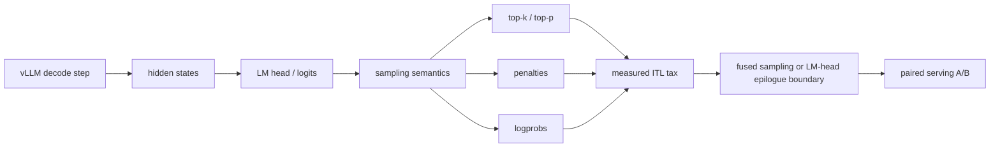

# Single-GPU Inference Lab

[](https://github.com/Kevin-Li-2025/single-gpu-inference-lab/actions/workflows/ci.yml)

Evidence-driven LLM inference systems research for single-GPU serving with
vLLM, FlashInfer, Triton, and CUDA.

This repository asks one narrow question:

> Which low-level inference optimizations still matter after they are placed
> inside a real serving stack?

The project is L20-first, but not L20-only. L20 is the primary target because
its 48 GB GDDR6 memory system exposes decode bottlenecks that HBM GPUs can hide.
A100 runs are used as controls so claims do not depend on one local machine.

This is not a replacement for vLLM, FlashInfer, TensorRT-LLM, PEFT, TRL, or
Megatron-LM. The useful output is the measured boundary between microkernel
speedups, integration behavior, and end-to-end token latency.

## Main Findings

- Modern vLLM greedy/no-penalty decode is already hard to improve.
- Sampling semantics are a better target than another standalone greedy kernel:
  top-k/top-p, repetition penalties, and logprobs added a measured 37%-42%
  median ITL tax in the current A100 control run.
- Sparse token-history sampling has real A100 serving evidence, but the claim is
  narrow: it beats vLLM's native PyTorch sampler path and shows a smaller
  low-single-digit improvement versus a FlashInfer-enabled path for the measured
  Qwen2.5-0.5B workload.
- A standalone L20 CUDA sparse repetition-penalty kernel now proves the same
  logits-processing boundary at the kernel level: 39 correct cases, 1.26x
  median speedup, and up to 4.09x on Qwen-size vocabularies with throughput
  batching. The measured dispatch policy selects sparse for 21/39 cases with
  zero regressions; batch-one cases remain launch-bound, so the next step is
  fusion into a larger sampler/logits boundary rather than another standalone
  launch.
- The L20 sparse-penalty serving work now has the full positive/negative loop:
  the official custom logits-processor path reaches vLLM but regresses serving,
  while moving the same idea into the fused sampler boundary gives a repeated
  4-row L20 serving-matrix signal. Fused median ITL is positive in all 4
  comparable Qwen3-0.6B rows; the standalone request-level processor is positive
  in only 1/4 rows.
- Combining sparse token-history sampling with fused generated-token
  top-logprobs now produces a repeated A100 serving win on the richer
  top-k/top-p + penalties + logprobs workload, with an 8-row model/logprobs
  matrix showing the strongest gains on small models and `logprobs=20`.
- Producer-side LM-head experiments remain boundary checks until they become a
  true GEMM epilogue or upstream-shaped integration.
- The CPU track has started as a control, not a new mainline: `cpp/my.cpp`
  implements a synthetic FP32 tiny-transformer decode path so CPU mechanics can
  be profiled before comparing against llama.cpp or real GGUF small models.
- Negative results stay in the repo when they change the direction.

## Current Checkpoint

The current active boundary is the LM-head / logits / sampling boundary.

The latest A100 semantic trace shows that a producer-side epilogue target exists
for top-k/top-p plus sparse penalties:

- Model: `Qwen/Qwen2.5-0.5B-Instruct`
- Stack: vLLM 0.10.2, FlashInfer sampling enabled, A100-SXM4-80GB
- Trace events: 320 total, 310 decode-safe
- Candidate target: `fused_topk_topp_sparse_penalty_lm_head_epilogue`
- Decode-side avoidable logits materialization budget: 179.67 MiB FP32
- Output mutation: disabled

Interpretation: the serving stack exposes the right semantic boundary, but the
next step must be a true producer-side epilogue or upstream-shaped integration.
A separate standalone Triton LM-head sparse-penalty path was correct but slower
than cuBLAS/full-logits baselines by 1.32x-1.39x on the tested A100 shapes.

## Best Evidence

| Boundary | Result | Artifact |
| --- | --- | --- |
| Sampling semantics tax | Greedy 6.720 ms median ITL; top-k/top-p + penalties 9.562 ms, or +42.29% | `benchmarks/results/a100-vllm-sampling-semantics-qwen25-05b/` |
| Dense top-k/top-p + penalties | 1.36x-1.42x A100 microbenchmark speedup versus apply-then-sample | `benchmarks/results/a100-fused-topk-topp-penalty/` |
| Sparse token-history penalties | 1.27x-1.31x A100 microbenchmark speedup without dense `[batch, vocab]` counts | `benchmarks/results/a100-sparse-topk-topp-penalty/` |
| L20 sparse repetition penalty | Standalone CUDA kernel: 39 correct L20 cases, 1.26x median speedup, up to 4.09x when full-vocab penalty scans dominate launch overhead; calibrated policy chooses sparse for 21/39 cases with zero measured regressions | `benchmarks/results/l20-sparse-repetition-penalty/` |
| L20 standalone logits-processor A/B | Real vLLM path proof but negative serving result: the CUDA op is hit 65 times, while median ITL regresses 14.33 ms -> 15.67 ms | `benchmarks/results/l20-sparse-repetition-penalty-serving/` |
| L20 fused sparse sampler | FlashInfer-enabled L20 smoke moves median ITL 2.609 ms -> 2.575 ms with 48/50 traced sampler events eligible; formal 4-row triangle matrix then keeps fused median ITL positive in 4/4 comparable rows | `benchmarks/results/l20-vllm-fused-sparse-sampling/`, `benchmarks/results/l20-sparse-penalty-triangle-matrix/` |
| L20 sparse penalty triangle | Native-vs-standalone-vs-fused Qwen3-0.6B matrix: fused median ITL is positive in 4/4 rows (+0.562%, +5.859%, +4.092%, +2.430%), fused median E2E is positive in 4/4 rows, and standalone logits processor is positive in only 1/4 rows | `benchmarks/results/l20-sparse-penalty-triangle-matrix/` |
| CPU tiny transformer scaffold | Self-written C++ FP32 synthetic decode path with RMSNorm, RoPE, KV cache, causal attention, greedy decode, and naive/tiled matmul; path proof only, not a real CPU small-model serving claim | `benchmarks/results/cpu-tiny-transformer/` |
| Sparse sampler vs native PyTorch path | Median ITL 9.544 ms -> 4.093 ms on A100/Qwen2.5-0.5B | `benchmarks/results/a100-vllm-sparse-penalty-sampling/` |
| Sparse sampler vs FlashInfer path | Median ITL 4.468 ms -> 4.346 ms on the same A100 workload | `benchmarks/results/a100-vllm-flashinfer-sparse-penalty-sampling/` |
| Fused top-logprobs selection | 8.04x-9.17x A100 microbenchmark speedup; dirty and clean A100 serving artifacts show path validation, while clean request-level total time stayed flat | `benchmarks/results/a100-fused-top-logprobs/`, `benchmarks/results/a100-vllm-top-logprobs-clean/` |
| Combined sparse sampling + fused top-logprobs | A100 multi-model serving matrix: 8 paired 30-run rows across Qwen2.5-0.5B, Qwen2.5-Coder-1.5B, Qwen3-0.6B, and Qwen3-1.7B. `logprobs=20` wins on all four models, with best median ITL 4.486 ms -> 4.254 ms (-5.18%) on Qwen2.5-0.5B and 5.053 ms -> 4.845 ms (-4.11%) on Qwen3-0.6B. | `benchmarks/results/a100-vllm-combined-sampling-logprobs-matrix/` |
| GEMM epilogue semantic trace | 310/320 decode-safe events; 179.67 MiB FP32 logits budget | `benchmarks/results/a100-vllm-gemm-epilogue-semantic-trace/` |
| Standalone LM-head sparse penalties | Correct but 1.32x-1.39x slower than cuBLAS/full-logits baselines | `benchmarks/results/a100-lm-head-sparse-penalty-boundary/` |
| L20 residual RMSNorm boundary | 24-shape L20 matrix with cache flush: all providers correct; fused residual RMSNorm often wins on decode/medium shapes, while large prefill mostly collapses to parity or small wins | `benchmarks/results/l20-residual-rmsnorm-v3/` |

## Boundary Diagram



## Hardware Scope

| Hardware | Role |
| --- | --- |
| L20 / Ada SM89 / 48 GB GDDR6 | Primary target for bandwidth-limited single-card decode serving. |
| A100 / SM80 / HBM | Control target for portability and claim discipline. |
| H100/H200/Blackwell | Reference ecosystem only unless this repo contains measured artifacts. |

See `docs/hardware-scope.md` for the full claim policy.

## What Is Not Claimed

- A microbenchmark speedup is not treated as an end-to-end serving result.
- The RoPE/KV and QK fusion work is valuable case-study evidence, but its
  serving impact is Amdahl-limited in current vLLM stacks.
- The standalone top-logprobs hook reached serving and was correct, but its
  clean A100 request-level result was flat. The new positive A100 result comes
  from combining it with sparse sampling on a richer sampling workload.
- The GEMM epilogue semantic trace proves eligibility and budget, not latency.
- Cross-GPU conclusions require measured artifacts on that GPU.

## Result Map

| Boundary | Status | Decision |
| --- | --- | --- |
| RoPE + paged KV append | Kernel-level positive | Keep as a case study; not the main current target. |
| Q/K norm + Q/K RoPE + KV write | Path validation | Useful integration proof, too small alone for a broad serving claim. |
| FlashInfer sampling route | Production comparator | Prewarm and compare against it when available. |
| Sparse top-k/top-p + penalties | Active positive path | Continue only through real vLLM serving A/B and upstream-shaped gates. |
| L20 sparse repetition penalty | Positive standalone CUDA boundary / negative standalone serving path | Keep as a kernel boundary and correctness oracle; do not claim serving win from the request-level logits processor. |
| L20 fused sparse penalty sampler | Positive 4-row L20 serving matrix | Keep the claim scoped to Qwen3-0.6B/c2-c8 shapes: fused median ITL wins in 4/4 comparable rows, while standalone request-level processor wins in only 1/4. |
| CPU tiny transformer | Path proof | Keep as a scalar C++ control for CPU decode mechanics and future CPU-vs-L20 break-even analysis. |
| Fused top-logprobs | Correct standalone path, flat request time | Useful only when folded into a larger sampling/logits boundary. |
| Combined sparse sampling + fused top-logprobs | Positive A100 serving matrix | First repeated combined-boundary serving win: 8 paired rows, 6/8 median ITL positives, and 4/4 positives at `logprobs=20`; every row proves `borrowed` raw logits and sparse-sampler trace coverage. |
| LM-head / GEMM epilogue | Current P0 boundary | Implement producer-side semantics instead of external standalone GEMM. |
| FP8 KV fused attention | Experimental | Keep disabled until repeated serving ITL beats BF16/FlashInfer. |
| Speculative/tree attention | Experimental | Research branch, not a stable serving result yet. |
| Kernel-coding QLoRA | Negative so far | Training stack works, but held-out KernelBench `fast_0` remains zero. |

Full status map: `docs/experiment-status.md`

## Docs

| Item | Path |
| --- | --- |
| Hardware and claim scope | `docs/hardware-scope.md` |
| Logits-boundary A/B plan | `docs/logits-boundary-ab.md` |
| Where optimizations stop mattering | `docs/where-optimizations-stop-mattering.md` |
| Experiment status map | `docs/experiment-status.md` |
| Top-tier kernel gaps | `docs/l20-top-tier-kernel-gaps.md` |
| KV/decode pipeline blueprint | `docs/l20-kv-decode-pipeline-blueprint.md` |
| L20 sparse penalty case study | `docs/l20-sparse-penalty-case-study.md` |
| CPU small-model boundary | `docs/cpu-small-model-boundary.md` |
| vLLM integration notes | `integrations/vllm/README.md` |
| Artifact index | `benchmarks/results/README.md` |
| Artifact catalog JSON | `benchmarks/results/artifact-catalog.json` |
| L20 sparse penalty triangle matrix | `benchmarks/results/l20-sparse-penalty-triangle-matrix/qwen3-0p6b-c2c4c8-o32o64-r64-v1/README.md` |
| CPU tiny transformer artifact | `benchmarks/results/cpu-tiny-transformer/README.md` |
| Combined A100 sampling/logprobs A/B | `benchmarks/results/a100-vllm-combined-sampling-logprobs/README.md` |
| Combined A100 sampling/logprobs matrix | `benchmarks/results/a100-vllm-combined-sampling-logprobs-matrix/README.md` |
| Serving optimization ceiling | `benchmarks/results/l20-serving-optimization-ceiling/README.md` |
| Logits-boundary scout artifact | `benchmarks/results/l20-vllm-logits-boundary-scout/README.md` |

## Reproduce

CPU-safe regression tests:

```bash
PYTHONPATH=src python -m unittest discover -s tests
```

Checked-in benchmark artifact index validation:

```bash
PYTHONPATH=src single-gpu-infer artifact-index
```

Local Markdown path validation:

```bash
PYTHONPATH=src single-gpu-infer doc-links
```

Machine-readable benchmark artifact catalog:

```bash
PYTHONPATH=src single-gpu-infer artifact-catalog \
  --output benchmarks/results/artifact-catalog.json
```

Self-written CPU tiny-transformer smoke:

```bash
scripts/bench_cpu_tiny_transformer.sh \
  --layers 2 \
  --dim 64 \
  --heads 4 \
  --vocab 1024 \
  --prompt 32 \
  --decode 16 \
  --matmul tiled \
  --tile 32 \
  --seed 7
```

Sampling-semantics probe against an OpenAI-compatible vLLM server:

```bash
PYTHONPATH=src python scripts/probe_vllm_sampling_semantics.py \
  --url http://127.0.0.1:18080/v1/completions \
  --model Qwen/Qwen2.5-0.5B-Instruct \
  --output-dir /tmp/sampling-semantics \
  --warmup 2 \
  --runs 10 \
  --max-tokens 64
```

Fused top-k/top-p + dense-penalty microbenchmark:

```bash
PYTHONPATH=src python scripts/benchmark_l20_topk_topp_penalty_sampling.py \
  --batch 1 \
  --vocab 151936 \
  --top-k 50 \
  --top-p 0.9 \
  --warmup 30 \
  --rounds 60 \
  --output /tmp/fused-topk-topp-penalty-b1.json
```

L20 CUDA sparse repetition-penalty benchmark:

```bash
scripts/run_l20_sparse_repetition_penalty.sh
```

L20 dispatcher-op smoke for the vLLM custom logits-processor scaffold:

```bash
python scripts/smoke_cuda_sparse_repetition_penalty_op.py
```

L20 paired serving A/B entrypoint for native vs custom sparse repetition
penalty:

```bash
EXECUTION_MODE=eager INPUT_TOKENS=512 MAX_CONCURRENCY=8 NUM_PROMPTS=32 \
scripts/run_vllm_l20_sparse_repetition_penalty_serving_ab.sh \
  /home/hhai/models/Qwen2.5-Coder-1.5B qwen25-coder-1p5b \
  benchmarks/results/l20-sparse-repetition-penalty-serving/eager-b8-i512 \
  /home/hhai/vllm-l20-rfc
```

L20 native-vs-standalone-vs-fused sparse-penalty triangle matrix:

```bash
MATRIX_ROWS="c2_i512_o32_r64 c4_i512_o32_r64 c8_i512_o32_r64 c4_i512_o64_r64" \
scripts/run_vllm_l20_sparse_penalty_triangle_matrix.sh \
  /home/hhai/models/Qwen3-0.6B qwen3-0p6b \
  benchmarks/results/l20-sparse-penalty-triangle-matrix/qwen3-0p6b-c2c4c8-o32o64-r64-v1 \
  /home/hhai/vllm-l20-rfc
```

GEMM epilogue semantic trace summary:

```bash
PYTHONPATH=src python scripts/summarize_l20_gemm_epilogue_trace.py \
  benchmarks/results/a100-vllm-gemm-epilogue-semantic-trace/qwen25-05b-topk-topp-penalty-r8/gemm_epilogue_trace.jsonl \
  --output /tmp/gemm-epilogue-semantic-summary.json
```

RMSNorm benchmark summary:

```bash
PYTHONPATH=src single-gpu-infer rmsnorm-summary \
  benchmarks/results/l20-residual-rmsnorm-v3/full-matrix-cacheflush64.json \
  --output /tmp/rmsnorm-summary.json
```

More commands and raw summaries are listed in `benchmarks/results/README.md`.

Boundary scripts:

- `integrations/vllm/install_l20_logits_boundary_trace.py`
- `scripts/summarize_l20_logits_boundary_trace.py`
- `scripts/run_vllm_l20_logits_boundary_trace_campaign.sh`
- `scripts/benchmark_l20_topk_topp_sampling.py`

## Repository Map

| Area | Purpose |
| --- | --- |
| `src/l20_stack/` | Legacy implementation namespace for CPU-safe planners, policy gates, memory calculators, and Triton/CUDA operator wrappers. |
| `cpp/` | Self-contained C++ CPU inference experiments such as `cpp/my.cpp`. |
| `integrations/vllm/` | Local vLLM patch installers and guarded dispatch helpers. |
| `scripts/` | Benchmarks, profiling wrappers, serving campaigns, scouts, and summarizers. |
| `benchmarks/results/` | Compact checked-in evidence: JSON summaries, serving reports, and short Markdown notes. |
| `docs/` | Research narrative, status map, hardware scope, and upstream/RFC notes. |
| `tests/` | CPU-safe and source-level regression tests. GPU benchmarks live under `scripts/`. |

Start with `docs/repo-map.md`, `docs/hardware-scope.md`,
`docs/where-optimizations-stop-mattering.md`, and
`benchmarks/results/README.md`.

## Evidence Policy

- Every performance claim must name hardware, model, command, and artifact.
- Microbenchmark wins are not serving results.
- Negative results stay when they change the direction.
- Checked-in artifacts should be compact and reviewable: `README.md`,
  `summary.json`, campaign summaries, and small serving JSON reports.
- Keep `benchmarks/results/README.md` machine-checkable with
  `single-gpu-infer artifact-index` whenever adding or renaming result
  directories.
- Do not commit model weights, checkpoints, datasets, secrets, `server.log`,
  `.nsys-rep`, SQLite exports, or large raw profiler captures.

## Name

The public project name is **Single-GPU Inference Lab**.

The original Python namespace remains `l20_stack` for compatibility with
existing scripts and checked-in artifacts. New public references should use
`Single-GPU Inference Lab` and the CLI entry point `single-gpu-infer`.
