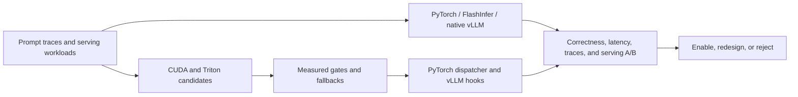

# Single-GPU Inference Lab

[](https://github.com/yinli-systems/single-gpu-inference-lab/actions/workflows/ci.yml)

Custom CUDA and Triton operators carried through PyTorch dispatcher
registration, guarded vLLM integration, and paired HTTP serving evaluation.
The project is designed to answer a systems question that microbenchmarks
alone cannot:

> Which kernel optimizations still matter after framework overhead, scheduling,
> CUDA Graph behavior, and production baselines are included?

The primary target is NVIDIA L20 (SM89, 48 GB GDDR6). A100 measurements are
used as controls, and Apple M4 experiments provide a CPU deployment boundary.

**Start here:** [reviewer guide](docs/reviewer-guide.md) ·
[featured case study](docs/l20-sparse-penalty-case-study.md) ·
[correctness notice](docs/sampling-correctness-notice-2026-07.md) ·
[result index](benchmarks/results/README.md) ·
[experiment status](docs/experiment-status.md) ·
[repository map](docs/repo-map.md)

## 60-Second Technical Review

| Boundary | Implementation | Measured result | Scope |
| --- | --- | --- | --- |
| [Fused top-logprobs](src/l20_stack/ops/triton_sampling.py) | Two-stage Triton selection that avoids full-vocabulary log-softmax materialization | [**8.04x–9.17x** versus composed PyTorch baselines](benchmarks/results/a100-fused-top-logprobs/README.md), matching token IDs with at most `4.768e-7` logprob error | Preallocated A100 microbenchmark; not a serving-speed claim |
| [Sparse repetition penalty](integrations/vllm/cuda/l20_sparse_repetition_penalty.cu) | Custom CUDA kernel plus [PyTorch `TORCH_LIBRARY` registration](integrations/vllm/cuda/l20_sparse_repetition_penalty.cpp) and measured dispatch gate | [**39/39** correct L20 cases; **1.26x** median and **4.09x** best kernel speedup](benchmarks/results/l20-sparse-repetition-penalty/README.md); 0/39 measured policy regressions | Standalone kernel matrix |
| [Residual RMSNorm](src/l20_stack/ops/triton_rmsnorm.py) | Triton fused residual-add + RMSNorm paths against PyTorch and FlashInfer | [**24/24** shapes correct; custom in-place path fastest on **14/24** shapes; best **2.412x**](benchmarks/results/l20-residual-rmsnorm-v3/README.md) | L20 FP16 microbenchmark; large prefill mostly approaches parity |
| [Serving-path correctness audit](docs/sampling-correctness-notice-2026-07.md) | Corrected nucleus threshold semantics, removed a hot-path host sync, hardened CUDA device checks, and disabled unsafe deferred-penalty fusion | Historical custom-sampler serving numbers are **excluded from current performance claims** until GPU remeasurement | Correctness takes precedence over retaining a favorable result |

Every performance number above links directly to a checked-in artifact.
Claims are deliberately separated into microbenchmark, integration-path, and
end-to-end serving evidence.

## Featured Engineering and Validation Loop

The sparse repetition-penalty work is the clearest end-to-end example:

```text
full-vocabulary PyTorch baseline
    -> sparse CUDA kernel
    -> measured dispatch policy
    -> PyTorch custom operator
    -> vLLM request-level integration
    -> fused Triton sampler boundary
    -> semantic parity audit
    -> historical serving claims withdrawn pending remeasurement
```

### 1. Isolate the wasted work

Repetition penalty only changes logits for tokens in the active history, while
a dense baseline scans the full `[batch, vocab]` tensor. The custom CUDA path
updates deduplicated token IDs and keeps a dense fallback outside its measured
win regime.

- [CUDA kernel](integrations/vllm/cuda/l20_sparse_repetition_penalty.cu)
- [PyTorch dispatcher registration](integrations/vllm/cuda/l20_sparse_repetition_penalty.cpp)
- [Standalone benchmark](cuda/sparse_repetition_penalty/)
- [Measured evidence](benchmarks/results/l20-sparse-repetition-penalty/README.md)

### 2. Integrate through PyTorch and vLLM

The CUDA implementation is registered as the mutating dispatcher op
`l20_stack::sparse_repetition_penalty_out`. The vLLM path is opt-in, validates
tensor contracts, preserves a fallback, and records trace coverage separately
from latency runs.

- [Opt-in processor](integrations/vllm/l20_sparse_repetition_penalty_logits_processor.py)
- [Serving runner](scripts/run_vllm_l20_sparse_repetition_penalty_serving_ab.sh)

### 3. Let correctness change the claim

The standalone CUDA result remains valid, but a later semantic audit found two
problems in the experimental fused serving route: the nucleus mask excluded the
token that first crossed `top_p`, and the penalty-history path could truncate a
long prompt. The code now keeps the threshold-crossing token and refuses fused
penalty execution unless the full, supported history is available. Historical
custom-sampler serving artifacts remain for traceability, but are not current
performance evidence. The vLLM installer now leaves native penalties enabled;
only the corrected sampling boundary may run experimentally, so an ineligible
request can fall back safely.

The [correctness notice](docs/sampling-correctness-notice-2026-07.md) defines
the revalidation gate. This is the intended engineering loop: hypothesis,
kernel implementation, framework integration, measurement, adversarial
semantic review, correction, and honest claim revision.

## What Is Implemented

| Area | Work in this repository | Representative entry points |
| --- | --- | --- |
| CUDA / PyTorch | Sparse repetition-penalty operator; experimental paged-decode prototypes; stream-aware launches, dispatcher schemas, fake registration, and guarded loading | [`integrations/vllm/cuda/`](integrations/vllm/cuda/), [`cuda/sparse_repetition_penalty/`](cuda/sparse_repetition_penalty/) |
| Triton kernels | Sampling, top-logprobs, RMSNorm, RoPE/KV writes, decode/tree attention, dequant GEMV, and LM-head boundary prototypes | [`src/l20_stack/ops/`](src/l20_stack/ops/) |
| vLLM integration | Opt-in installers, fallback-first hooks, trace instrumentation, and experimental serving runners | [`integrations/vllm/`](integrations/vllm/) |
| Measurement | Correctness matrices, CUDA-event timing, NSYS/NCU summaries, TTFT/ITL/throughput A/Bs, and machine-readable artifacts | [`scripts/`](scripts/), [`benchmarks/results/`](benchmarks/results/) |
| CPU control track | Transformer mechanics, M4 Q4×Q8 NEON, real GGUF Q4_K parsing, and bounded CPU/GPU comparisons | [`cpp/`](cpp/), [`benchmarks/results/cpu-real-model/`](benchmarks/results/cpu-real-model/) |

The repository contains experimental paths as well as confirmed results.
Nothing is default-enabled from a microbenchmark win alone.

## System Shape



## Selected Evidence

| Result | Evidence | Interpretation |
| --- | --- | --- |
| A100 fused top-logprobs | [artifact](benchmarks/results/a100-fused-top-logprobs/README.md) | Current Triton operator result; serving benefit must be measured separately |
| L20 sparse repetition penalty | [artifact](benchmarks/results/l20-sparse-repetition-penalty/README.md) | Current CUDA operator result and measured dispatch regime |
| L20 residual RMSNorm | [artifact](benchmarks/results/l20-residual-rmsnorm-v3/README.md) | Current Triton fusion result; shape-dependent rather than universal |
| Custom top-p serving paths | [correctness notice](docs/sampling-correctness-notice-2026-07.md) | Historical only; excluded until corrected, native-equivalent reruns exist |
| Negative and superseded paths | [status ledger](docs/experiment-status.md) | Failed or invalidated paths remain visible and constrain current claims |

The curated catalog is in the [result index](benchmarks/results/README.md) and
[machine-readable catalog](benchmarks/results/artifact-catalog.json).

## Further Review Entry Points

| Topic | Path |
| --- | --- |
| Logits-boundary A/B plan | [`docs/logits-boundary-ab.md`](docs/logits-boundary-ab.md) |
| Top-tier kernel and profiling gaps | [`docs/l20-top-tier-kernel-gaps.md`](docs/l20-top-tier-kernel-gaps.md) |
| Serving optimization ceiling | [`benchmarks/results/l20-serving-optimization-ceiling/`](benchmarks/results/l20-serving-optimization-ceiling/) |
| vLLM logits-boundary scout | [`benchmarks/results/l20-vllm-logits-boundary-scout/`](benchmarks/results/l20-vllm-logits-boundary-scout/) |
| Logits-boundary trace installer | [`integrations/vllm/install_l20_logits_boundary_trace.py`](integrations/vllm/install_l20_logits_boundary_trace.py) |
| Trace summarizer | [`scripts/summarize_l20_logits_boundary_trace.py`](scripts/summarize_l20_logits_boundary_trace.py) |
| Trace campaign | [`scripts/run_vllm_l20_logits_boundary_trace_campaign.sh`](scripts/run_vllm_l20_logits_boundary_trace_campaign.sh) |
| Standalone top-k/top-p benchmark | [`scripts/benchmark_l20_topk_topp_sampling.py`](scripts/benchmark_l20_topk_topp_sampling.py) |

Fused top-logprobs selection has both
[dirty and clean A100 path-proof artifacts](benchmarks/results/a100-vllm-top-logprobs-clean/);
only the clean run is used for interpretation, and its total request time is
flat.

## Reproduce and Validate

The default CI is CPU-safe: it installs CPU PyTorch, validates public artifact
links, builds the result catalog, runs the test suite, and compiles Python
sources. On a clean Linux environment:

```bash
python -m venv .venv
source .venv/bin/activate
python -m pip install --upgrade pip
python -m pip install -e ".[dev]" numpy
python -m pip install torch --index-url https://download.pytorch.org/whl/cpu

python -m pytest -q
single-gpu-infer artifact-index --strict-warnings
single-gpu-infer doc-links
single-gpu-infer artifact-catalog --output /tmp/artifact-catalog.json
```

GPU results require the hardware and versions named in each artifact. The most
direct standalone CUDA reproduction is:

```bash
scripts/run_l20_sparse_repetition_penalty.sh
```

The corrected sampler can be remeasured with:

```bash
scripts/run_vllm_l20_sparse_penalty_triangle_matrix.sh
```

That command does not reinstate the historical serving claim by itself; the
[revalidation gate](docs/sampling-correctness-notice-2026-07.md) also requires
native-equivalent semantic parity, repeated runs, raw samples, and provenance.
These commands are not advertised as hardware-portable defaults.

## Claim Policy

- Name the hardware, model, workload, baseline, and artifact for every
  performance claim.
- Treat microbenchmark, path-proof, and serving results as different evidence
  levels.
- Keep trace runs separate from latency runs.
- Report negative and mixed rows; do not summarize a partial win as universal.
- Withdraw a performance claim when a later semantic audit invalidates its
  comparator, even if the historical number was favorable.
- Do not extrapolate L20 or A100 measurements to other GPU families.
- Keep model weights, datasets, raw profiler databases, caches, and secrets out
  of git.

See the [hardware policy](docs/hardware-scope.md) and
[compact systems thesis](docs/where-optimizations-stop-mattering.md).

## Repository Map

| Path | Purpose |
| --- | --- |
| `src/l20_stack/ops/` | Triton kernels and launch/dispatch policies |
| `integrations/vllm/` | PyTorch custom ops, vLLM hooks, and reversible installers |
| `cuda/` | Standalone CUDA experiments |
| `scripts/` | Benchmarks, profilers, serving campaigns, and summarizers |
| `benchmarks/results/` | Compact JSON/CSV/Markdown evidence |
| `docs/` | Case studies, status ledger, hardware scope, and research decisions |
| `tests/` | CPU-safe behavioral, integration-contract, and source-level tests |
| `cpp/` | CPU and Apple M4 control experiments |

The public project name is **Single-GPU Inference Lab**. The Python namespace
remains `l20_stack` for compatibility with existing scripts and checked-in
artifacts.
