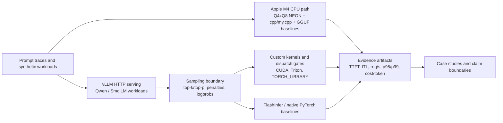

# Single-GPU Inference Lab

[](https://github.com/Kevin-Li-2025/single-gpu-inference-lab/actions/workflows/ci.yml)

Evidence-driven LLM inference systems research for single-GPU serving with
vLLM, FlashInfer, Triton, CUDA, and CPU baselines.

This repo asks one narrow question:

> Which low-level inference optimizations still matter after they are placed
> inside a real serving stack?

The project is L20-first, but not L20-only. L20 is the primary target because
its 48 GB GDDR6 memory system exposes decode bottlenecks that HBM GPUs can hide.
A100 runs are used as controls, and Apple M4 CPU measurements define the local
small-model break-even boundary.

## Architecture



## Current Headline

The strongest current result is the CPU-to-L20 deployment boundary for
`Qwen2.5-Coder-0.5B-Instruct`.

| Workload | M4 CPU serial req/s | L20 FlashInfer req/s | L20 vs M4 | L20 cost / 1M output tokens |
| --- | ---: | ---: | ---: | ---: |
| p512/o32 c8 | 0.568 | 59.906 | 105.43x | `$0.1159` at `$0.80/h` |
| p512/o128 c8 | 0.351 | 22.382 | 63.78x | `$0.0776` at `$0.80/h` |

The same evidence includes:

- p95/p99 tail tables for FlashInfer and torch/native sampling;
- a fixed 12-prompt code trace through real L20 vLLM HTTP streaming;
- 12/12 prompt completion, 26.198 ms median TTFT, and 2.142 ms median
  per-prompt ITL.

Artifacts:

- `benchmarks/results/cpu-l20-break-even/`
- `benchmarks/results/cpu-l20-break-even/qwen25-coder-0p5b-identical-model-v1/`
- `benchmarks/results/cpu-l20-break-even/qwen25-coder-0p5b-real-prompt-trace-v1/`

Cost uses a configurable L20 hourly rate and excludes host CPU, storage,
network, idle time, and provider discounts. The real-prompt p95/p99 TTFT tail is
small-sample trace evidence, not a production SLO.

## What This Repo Proves

- Microkernel wins are not enough. Several kernels win in isolation but shrink
  or disappear after vLLM scheduling, CUDA Graph behavior, FlashInfer, and
  end-to-end token latency are included.
- Sampling semantics matter. Top-k/top-p, repetition penalties, and logprobs
  add a measurable serving tax and are better targets than plain greedy decode.
- Negative results are useful. The standalone vLLM logits-processor route for
  sparse repetition penalty reached real serving but regressed ITL, which pushed
  the work toward fused sampler and LM-head/logits boundaries.
- The next high-leverage GPU target is producer-side LM-head/logits work, not
  another standalone sampler launch.
- The CPU track is a real control, not a mock: `cpp/my.cpp` is a self-written
  decode mechanics scaffold, while Qwen/SmolLM GGUF runs provide real CPU
  baselines.
- The M4 kernel track is shape-aware: the self-written Q4 x Q8 NEON matvec
  dispatches narrow projections to one performance core and FFN projections to
  four, reaching a 2.00x geometric-mean win over its same-thread scalar oracle
  across six Qwen2.5-0.5B layer shapes. This remains microbenchmark evidence.
- The real Q4_K gate is now closed: a self-written GGUF v3 parser and Q4_K
  kernel read actual Qwen tensors, match llama.cpp within 1e-6, and reach real
  decode with byte-identical output. The opt-in path is essentially flat
  (`0.995x-0.997x`), so llama.cpp repacking remains the default.
- The larger-model M4 control uses real Qwen2.5-Coder-3B weights. A 4/6/8/10
  thread sweep selects the four performance cores; CPU, llama.cpp Metal, and
  MLX reach 34.84, 46.92, and 54.72 real-completion tok/s respectively. The
  llama.cpp CPU/Metal outputs are byte-identical, and all five MLX runs are
  stable. MLX uses a different 4-bit format, so this is a runtime comparison.

## What I Implemented

I personally implemented the code paths, integration scaffolding, and evidence
generators in this repo. The checked-in model weights and third-party serving
engines are external dependencies; the benchmark harnesses, dispatch policy,
custom kernels, vLLM patch points, summaries, and claim checks are the work
product here.

| Layer | What I built | Representative files |
| --- | --- | --- |
| CUDA operator | Sparse repetition-penalty kernel, policy gate, and PyTorch `TORCH_LIBRARY` registration path for vLLM-shaped logits workloads. | `cuda/sparse_repetition_penalty/`, `integrations/vllm/cuda/`, `scripts/smoke_cuda_sparse_repetition_penalty_op.py` |
| vLLM integration | Opt-in logits processor and fused sampler patch routes that compare standalone request-level hooks against sampler-boundary integration. | `integrations/vllm/l20_sparse_repetition_penalty_logits_processor.py`, `integrations/vllm/install_l20_topk_topp_sampler.py`, `scripts/run_vllm_l20_sparse_penalty_triangle_matrix.sh` |
| CPU inference path | Self-written C++ transformer scaffold, M4 Q4 x Q8 NEON matvec, GGUF v3 parser, real Q4_K kernels, affine Q4_K-to-SME2 transform, reversible llama.cpp decode hooks, power-qualified SME2 A/B, and reproducible 3B CPU/Metal/MLX matrix. | `cpp/my.cpp`, `cpp/m4_q4_matvec.cpp`, `cpp/m4_q4k_gguf.cpp`, `cpp/m4_q4k_sme2.cpp`, `integrations/llama_cpp/`, `scripts/run_m4_q4k_real_model_ab.py`, `scripts/run_m4_q4k_sme2_ab.py`, `scripts/run_m4_large_model_matrix.py` |
| Benchmark system | Reproducible CPU/L20/A100 campaign scripts, result summarizers, cost-per-token and p95/p99 tail calculators, and real prompt trace clients. | `scripts/build_cpu_l20_break_even.py`, `scripts/build_cpu_l20_cost_tail.py`, `scripts/run_real_prompt_trace_client.py` |
| Evidence hygiene | Artifact index, public doc-link checker, compact artifact catalog, CPU-safe tests, and claim-policy docs to keep benchmark claims bounded. | `src/l20_stack/`, `tests/`, `benchmarks/results/artifact-catalog.json`, `docs/experiment-status.md` |

## Best Evidence

| Area | Result | Artifact |
| --- | --- | --- |
| CPU vs L20 break-even | Same-model Qwen2.5-Coder-0.5B boundary, cost/tail table, and real prompt trace | `benchmarks/results/cpu-l20-break-even/` |
| L20 sparse repetition penalty | 39 correct CUDA cases, 1.26x median kernel speedup, zero-regression dispatch policy | `benchmarks/results/l20-sparse-repetition-penalty/` |
| L20 fused sparse sampler | Fused sampler wins 4/4 comparable Qwen3-0.6B rows; standalone logits processor wins only 1/4 | `benchmarks/results/l20-sparse-penalty-triangle-matrix/` |
| A100 sampling semantics | Top-k/top-p + penalties adds about +42% median ITL over greedy/no-penalty | `benchmarks/results/a100-vllm-sampling-semantics-qwen25-05b/` |
| A100 sparse sampling | Sparse token-history path improves real vLLM serving versus native PyTorch and FlashInfer baselines | `benchmarks/results/a100-vllm-sparse-penalty-sampling/`, `benchmarks/results/a100-vllm-flashinfer-sparse-penalty-sampling/` |
| A100 sampling + logprobs | Combined sparse sampling and fused top-logprobs wins the richer logprobs workload across an 8-row matrix | `benchmarks/results/a100-vllm-combined-sampling-logprobs-matrix/` |
| LM-head boundary | Semantic trace exposes 310/320 decode-safe events and 179.67 MiB FP32 logits materialization budget | `benchmarks/results/a100-vllm-gemm-epilogue-semantic-trace/` |
| CPU mechanics | Self-written C++ tiny-transformer path plus real GGUF CPU baselines | `benchmarks/results/cpu-tiny-transformer/`, `benchmarks/results/cpu-real-model/` |
| M4 Q4 x Q8 kernel | Six Qwen2.5-0.5B layer shapes, 6/6 exact, 2.00x geomean over same-thread scalar | `benchmarks/results/cpu-m4-q4-matvec/qwen25-0p5b-m4/` |
| M4 real Q4_K decode | Real GGUF tensor parser, 1e-6 kernel agreement, byte-identical serving output, and llama.cpp/MLX A/B | `benchmarks/results/cpu-m4-q4k-real-model/qwen25-coder-0p5b-v1/` |
| M4 real Qwen 3B matrix | Four-core CPU 34.84, llama.cpp Metal 46.92, MLX 54.72 real-completion tok/s; no mock weights | `benchmarks/results/cpu-m4-large-model/qwen25-coder-3b-v1/` |
| M4 Q4_K affine SME2 | Real FFN tensors win 1.132x-1.158x over custom raw NEON. The AC-qualified 6x5 triangle improves the old system result but still reaches only 0.9692x versus llama x8; parallel correction is 0.9998x versus serial. Both remain disabled. | `benchmarks/results/cpu-m4-q4k-sme2/qwen25-coder-3b-affine-v1/` |

For the full status map, use `docs/experiment-status.md`.

## Repository Map

| Path | Purpose |
| --- | --- |
| `src/l20_stack/` | Compatibility namespace for policy gates, CLI checks, memory calculators, and operator wrappers. |
| `cpp/` | Self-contained C++ CPU inference experiments, including `cpp/my.cpp`. |
| `integrations/vllm/` | Local vLLM patch installers and guarded dispatch helpers. |
| `scripts/` | Benchmarks, serving campaigns, profilers, scouts, and summarizers. |
| `benchmarks/results/` | Compact checked-in evidence: JSON summaries, serving reports, and short Markdown notes. |
| `benchmarks/prompt_traces/` | Fixed public prompt traces used for real workload checks. |
| `docs/` | Research narrative, hardware scope, experiment status, and upstream/RFC notes. |
| `tests/` | CPU-safe and source-level regression tests. GPU benchmarks live under `scripts/`. |

Start here:

- `docs/repo-map.md`
- `docs/experiment-status.md`
- `docs/hardware-scope.md`
- `docs/where-optimizations-stop-mattering.md`
- `benchmarks/results/README.md`

Additional evidence links:

| Topic | Entry point |
| --- | --- |
| Logits-boundary A/B plan | `docs/logits-boundary-ab.md` |
| Top-tier kernel gaps | `docs/l20-top-tier-kernel-gaps.md` |
| Fused top-logprobs selection | `benchmarks/results/a100-fused-top-logprobs/` |
| A100 top-logprobs route | dirty and clean A100 traces: `benchmarks/results/a100-vllm-top-logprobs-smoke/`, `benchmarks/results/a100-vllm-top-logprobs-clean/` |
| L20 serving ceiling | `benchmarks/results/l20-serving-optimization-ceiling/README.md`, `benchmarks/results/l20-vllm-logits-boundary-scout/README.md` |
| L20 logits-boundary tools | `integrations/vllm/install_l20_logits_boundary_trace.py`, `scripts/summarize_l20_logits_boundary_trace.py`, `scripts/run_vllm_l20_logits_boundary_trace_campaign.sh`, `scripts/benchmark_l20_topk_topp_sampling.py` |

## Reproduce And Validate

CPU-safe regression tests:

```bash
PYTHONPATH=src python -m unittest discover -s tests
```

Checked-in artifact index:

```bash
PYTHONPATH=src single-gpu-infer artifact-index --strict-warnings
```

Markdown link validation:

```bash
PYTHONPATH=src single-gpu-infer doc-links
```

Artifact catalog regeneration:

```bash
PYTHONPATH=src single-gpu-infer artifact-catalog \
  --output benchmarks/results/artifact-catalog.json
```

CPU tiny-transformer smoke:

```bash
scripts/bench_cpu_tiny_transformer.sh \
  --layers 2 \
  --dim 64 \
  --heads 4 \
  --vocab 1024 \
  --prompt 32 \
  --decode 16 \
  --matmul tiled \
  --tile 32 \
  --seed 7
```

Apple M4 Q4 x Q8 layer-shape matrix:

```bash
/usr/bin/python3 scripts/benchmark_m4_q4_matvec_matrix.py \
  --threads 4 \
  --warmup 10 \
  --iterations 50 \
  --cache-flush-mib 64
```

Build and benchmark the opt-in real Q4_K path:

```bash
LLAMA_ROOT=build/llama.cpp scripts/build_llama_cpp_m4_q4k.sh

/usr/bin/python3 scripts/run_m4_q4k_real_model_ab.py \
  --model /path/to/qwen2.5-coder-0.5b-instruct-q4_k_m.gguf \
  --llama-bench build/llama.cpp/build-cpu-kevin/bin/llama-bench \
  --llama-completion build/llama.cpp/build-cpu-kevin/bin/llama-completion
```

Bootstrap the validated MLX environment and run the real Qwen 3B matrix:

```bash
scripts/bootstrap_mlx_m4.sh build/mlx-venv

build/llama.cpp/build-metal-m4/bin/llama-bench \
  -m /path/to/qwen2.5-coder-3b-instruct-q4_k_m.gguf \
  -p 0 -n 128 -t 4,6,8,10 -ngl 0 -r 5 --delay 1 -o json \
  > build/qwen3b-cpu-thread-sweep.json

build/mlx-venv/bin/python scripts/run_m4_large_model_matrix.py \
  --model /path/to/qwen2.5-coder-3b-instruct-q4_k_m.gguf \
  --llama-bench build/llama.cpp/build-metal-m4/bin/llama-bench \
  --llama-completion build/llama.cpp/build-metal-m4/bin/llama-completion \
  --mlx-python build/mlx-venv/bin/python \
  --cpu-thread-sweep-json build/qwen3b-cpu-thread-sweep.json \
  --threads 4
```

Build the standalone real-Q4_K affine SME2 gate:

```bash
scripts/build_m4_q4k_sme2.sh build/m4_q4k_sme2

build/m4_q4k_sme2 \
  --model /path/to/qwen2.5-coder-3b-instruct-q4_k_m.gguf \
  --tensor blk.0.ffn_up.weight \
  --warmup 3 --iterations 20 --cache-flush-mib 64
```

The llama.cpp integration is deliberately opt-in. Its current end-to-end gate
is negative; see `docs/m4-q4k-sme2-case-study.md` before enabling
`GGML_M4_Q4K_SME2=1`.

```bash
LLAMA_ROOT=build/llama.cpp scripts/build_llama_cpp_m4_q4k_sme2.sh
```

Real Qwen CPU completion smoke on Apple M4:

```bash
scripts/run_m4_cpu_qwen_inference.py
```

CPU/L20 break-even tables:

```bash
/usr/bin/python3 scripts/build_cpu_l20_break_even.py \
  --mode cpu_l20_same_model_break_even \
  --title "CPU vs L20 Break-Even: Qwen2.5-Coder-0.5B p512" \
  --l20-model Qwen2.5-Coder-0.5B-Instruct \
  --l20-o32 benchmarks/results/cpu-l20-break-even/qwen25-coder-0p5b-identical-model-v1/p512-o32/summary.json \
  --l20-o128 benchmarks/results/cpu-l20-break-even/qwen25-coder-0p5b-identical-model-v1/p512-o128/summary.json \
  --output-dir benchmarks/results/cpu-l20-break-even/qwen25-coder-0p5b-identical-model-v1

/usr/bin/python3 scripts/build_cpu_l20_cost_tail.py \
  --artifact-dir benchmarks/results/cpu-l20-break-even/qwen25-coder-0p5b-identical-model-v1 \
  --l20-hourly-usd 0.80
```

GPU serving campaigns require the target model, vLLM source tree, and an L20 or
A100 host. Individual artifact READMEs contain the exact commands used for each
run.

## Claim Policy

- Every performance claim must name hardware, model, command, and artifact.
- Microbenchmark wins are not serving results.
- Negative results stay when they change the direction.
- Cross-GPU conclusions require measured artifacts on that GPU.
- Checked-in artifacts should be compact and reviewable: `README.md`,
  `summary.json`, campaign summaries, and small serving JSON reports.
- Do not commit model weights, checkpoints, datasets, secrets, `server.log`,
  `.nsys-rep`, SQLite exports, or large raw profiler captures.

## Name

The public project name is **Single-GPU Inference Lab**.

The Python namespace remains `l20_stack` for compatibility with existing
scripts and checked-in artifacts. New public references should use the project
name and the CLI entry point `single-gpu-infer`.
