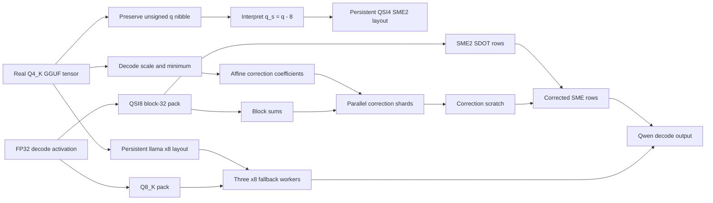

# Apple M4 Q4_K Affine SME2 Case Study

## Question

Can an SME2 signed-int4 GEMV beat llama.cpp's Q4_K decode path on a base Apple
M4 without converting the model to a different quantization format?

The tested model is the official Qwen2.5-Coder-3B-Instruct Q4_K_M GGUF. The
proof starts from mapped GGUF tensors, not random matrices or reconstructed
FP16 weights.

## What I Implemented

- a shared GGUF v2/v3 parser and Q4_K ABI in `cpp/m4_gguf_q4k.hpp`;
- a real-tensor Q4_K to QSI4 block-32 converter in `cpp/m4_q4k_sme2.cpp`;
- explicit Q4_K affine-min correction and a scalar numerical oracle;
- persistent SME2, correction, and x8 fallback layouts for llama.cpp;
- a reversible opt-in llama.cpp KleidiAI installer;
- four-thread hybrid dispatch with one SME worker and three x8 NEON workers;
- overlapped affine correction computed by fallback workers while SME2 runs;
- real Qwen tensor, `llama-bench`, tail, and greedy-output gates.

Arm KleidiAI supplies the QSI8/QSI4 packers and SME2 SDOT microkernel. The
GGUF parsing, Q4_K-preserving transform, correction path, hybrid dispatch,
integration, and benchmark gates are implemented in this repository.

## Data Path



## Quantization Math

For each 32-value Q4_K group, llama.cpp reconstructs a weight as:

```text
w = (d * scale) * q - (dmin * minimum)
```

KleidiAI's signed-int4 kernel consumes `q_s = q - 8`. Rewriting gives:

```text
w = (d * scale) * q_s + (8 * d * scale - dmin * minimum)
```

The first term goes through SME2 SDOT. The second term multiplies a stored
coefficient by the sum of the corresponding activation block. The public
KleidiAI path stores the per-32 weight scale as FP16, so the correction uses
the same rounded scale. This makes the implemented kernel agree with its
quantized mathematical reference at `1e-7` normalized RMSE.

## Results

| Test | Correctness | Performance |
| --- | ---: | ---: |
| `blk.0.ffn_up.weight`, `11008 x 2048` | 0.3787% NRMSE vs FP32 activation | 1.132x vs custom raw NEON |
| `blk.12.ffn_down.weight`, `2048 x 11008` | 0.3844% NRMSE vs FP32 activation | 1.158x vs custom raw NEON |
| Qwen 3B `tg128`, 5 repeats | real model | 0.857x vs llama x8 |
| Fixed greedy prompt | byte-identical output | 0.863x completion decode |

The candidate `tg128` median is 29.13 tok/s versus 33.98 tok/s baseline. Its
p95/p99 ITL is 40.36/40.58 ms, versus 30.16/30.30 ms. The real prompt output
is identical, but prefill, decode, and load time all regress.

## Why The Micro Win Did Not Survive

1. llama.cpp's baseline is an eight-row interleaved kernel using four CPU
   workers; a single-SMCU comparison against raw one-row NEON is not the real
   system baseline.
2. Hybrid dispatch requires two activation formats and two persistent weight
   layouts. The extra packing, scheduling, and memory traffic consume the
   isolated SME2 gain.
3. Retaining original weights for prefill fallback plus SME2, correction, and
   x8 layouts raises measured model buffers to about 6.01 GiB.
4. Longer decode runs expose unstable SME/NEON coexistence tails that short
   kernel medians do not show.

## Decision

`GGML_M4_Q4K_SME2=1` remains an explicit research switch. It is not enabled
by default and is not presented as faster full-model inference. The useful
result is the exact Q4_K affine mapping and the measured proof that a positive
single-layer SME2 result is insufficient to beat llama.cpp's production x8
decode on a base M4.

## Dispatch Follow-up

The first hybrid made every fallback worker quantize the same activation and
enabled SME2 for all large FFN tensors. The follow-up implementation changes
the opt-in defaults to:

- `ffn_down` tensors only;
- one Q8_K activation pack shared by the three x8 workers;
- concurrent SME/Q8 packing followed by one thread-pool barrier;
- 25% of output rows on SME2 and 75% on the three x8 workers.

A second scheduling follow-up removes the serial correction tail from the SME
worker. The three fallback workers compute disjoint correction rows while the
SME2 kernel runs, write them to thread-pool scratch, and synchronize before all
four workers add disjoint output ranges. Setting
`GGML_M4_Q4K_SME2_PARALLEL_CORRECTION=1` enables this candidate; unset or `0`
uses the serial path. The accumulation order within each row is unchanged.

The fixed greedy prompt remains byte-identical with SHA-256
`8ff2391976022289e0b35ded5071463b329a85a615884fdac0febe44a1151c59`.
An FP16 correction experiment was rejected because it changed the generated
tokens; the integrated path therefore retains FP32 correction coefficients.

The final AC-qualified run uses `--include-serial-control` to rotate native
llama x8, serial correction, and parallel correction through three orderings.
Six pairs with five `tg128` repetitions per mode produce these pooled medians:

| Mode | Pooled median | Comparison |
| --- | ---: | ---: |
| Native llama x8 | 33.6642 tok/s | baseline |
| Serial correction | 32.6358 tok/s | 0.9694x vs llama |
| Parallel correction | 32.6287 tok/s | 0.9692x vs llama, 0.9998x vs serial |

All three fixed greedy outputs have the same SHA-256. Both performance gates
fail: parallel-versus-llama has `0.9480x` minimum pair speedup, and
parallel-versus-serial has `0.9691x`. The earlier positive battery diagnostic
does not survive the qualified protocol, so parallel correction is opt-in and
the full SME2 integration remains disabled.

A battery/low-power diagnostic produced pooled medians of 14.7819 tok/s for
baseline and 14.7616 tok/s for the follow-up. This is not a publishable
performance result: the host was in low-power mode and had high background
load, and one pair was severely contaminated. The checked-in
`scripts/run_m4_q4k_sme2_ab.py` runner refuses to produce a formal result
unless the Mac is on AC power, low-power mode is disabled, and one-minute load
is below its configured threshold. `qualified-triangle.json` is the current
authoritative parallel-correction result.

## Vectorized Serial Result

The next pass returns to serial correction and removes two local setup costs:
Q8_K activation packing uses NEON, and correction processes four output rows
in parallel while retaining the original accumulation order within each row.
The runner exposes this path with `--candidate-correction serial`.

With AC power, low-power mode disabled, four performance cores, and a qualified
`0.2394` load per logical CPU, the 6x5 alternating A/B produces:

| Mode | Pooled median | Comparison |
| --- | ---: | ---: |
| Native llama x8 | 33.7515 tok/s | baseline |
| Vectorized serial hybrid | 33.4776 tok/s | 0.9919x vs llama |

The pooled deficit is reduced to `0.81%`, but the median pair speedup is only
`0.9874x` and the minimum pair is `0.9701x`; the promotion gate still fails.
The fixed greedy output remains byte-identical. `bird` and `fileproviderd`
were paused to remove iCloud synchronization interference and restored after
the run. The full SME2 integration therefore remains opt-in and disabled by
default. `qualified-serial-neon.json` is the authoritative artifact for this
candidate.
