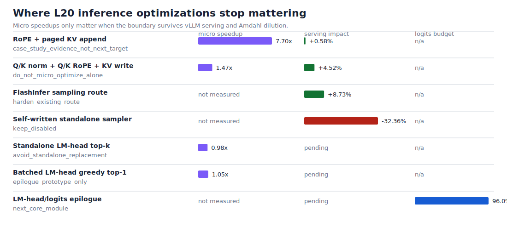

# Where LLM Inference Optimizations Stop Mattering on a Single L20 GPU

## Abstract

This repository studies a practical LLM serving question on one NVIDIA L20:
which inference optimizations survive the jump from microkernel speedup to
end-to-end token latency?

The main finding is that several attractive kernel boundaries are already too
small inside a modern vLLM + FlashInfer serving stack. RoPE/KV-cache update,
Q/K norm + RoPE + KV write, and standalone sampling kernels can be correct and
fast in isolation, yet still have low or negative serving impact once attention,
GEMM/GEMV, CUDA Graph capture, scheduler work, and sampler integration overhead
are included.

The current high-leverage boundary is not another isolated sampler or RoPE/KV
kernel. It is the LM-head / logits / sampling epilogue: a production-shaped
boundary that avoids full-logits materialization and mutation for the safe
decode subset without changing unsupported sampling semantics.

## Setting

| Component | Configuration |
| --- | --- |
| GPU | NVIDIA L20, Ada SM89, 48 GB GDDR6 |
| Runtime | vLLM local source tree with FlashInfer attention/sampling |
| Primary model for latest trace | Qwen3-0.6B, FP16, O2/CUDA graph path |
| Evidence style | Paired serving JSON, NSYS/NCU summaries, trace JSONL, negative results |

The L20 is not treated as a smaller H100. The repo keeps the claim scoped to an
Ada SM89 PCIe card with GDDR6 bandwidth and a different serving bottleneck mix.

## Method

The project runs each optimization through four gates:

1. **operator correctness**: the candidate must preserve outputs/caches;
2. **microbenchmark**: the intended boundary must win in isolation;
3. **vLLM path proof**: the serving stack must actually hit the intended path;
4. **paired serving impact**: median ITL, TTFT, throughput, and fallback status
   must be measured against a production baseline.

This gate rejects several tempting claims. A fast kernel is not counted as a
serving win unless the full stack improves.

## Findings

| Boundary | Micro signal | Serving/system signal | Decision |
| --- | --- | --- | --- |
| RoPE + paged KV append | Roughly 7-8x write-path speedup in the strongest micro runs | Large batch/context attention dilutes the gain; serving impact is marginal | Keep as case-study evidence |
| Q/K norm + Q/K RoPE + KV write | Correct O2 custom path, up to 1.47x micro speedup | Path is live but small in NSYS GPU-time share | Do not optimize alone |
| FlashInfer sampling route | Production route, not a custom kernel | Wins most paired serving shapes versus torch/native sampling | Harden and prewarm |
| Self-written standalone sampler | Path reaches vLLM hot path | Median ITL regresses versus FlashInfer | Keep disabled |
| Standalone LM-head top-k | Chunked top-k and batch-1 direct top-1 are slower than full logits | Not worth serving integration | Avoid standalone replacement |
| Batched LM-head greedy top-1 | Batch-4 direct top-1 reaches 0.677 ms vs 0.712 ms full logits, a 4.8% micro speedup | No vLLM serving integration and no top-k/top-p semantics yet | Keep as epilogue prototype evidence |
| LM-head/logits epilogue | 96.00% trace eligibility; 339.93 MiB eligible logits materialization in latest smoke | A/B sampler hook regressed; epilogue kernel work is now the narrower target | Current P0 |

The generated artifact for this table is:
`benchmarks/results/l20-boundary-impact/`.

## Negative Results

The negative results are part of the contribution:

- the self-written top-k/top-p sampler regresses real vLLM serving despite
  reaching the custom path;
- standalone no-full-logits top-k does not beat the optimized full-logits path;
- batched greedy top-1 can beat full logits in a narrow microbenchmark, but it is not yet a production sampler path;
- current FP8 KV-cache decode prototypes do not justify a vLLM dispatch gate;
- custom RoPE/KV-style kernels are often Amdahl-limited once attention and
  model compute are included.

These failures narrow the search space and explain why the next boundary must
move closer to the LM-head/GEMM epilogue and production sampler state.

## Current Research Claim

The repo's strongest claim is not "this kernel beats vLLM." The stronger claim
is:

> On a single L20, many plausible LLM inference kernel wins stop mattering at
> the serving boundary; trace-driven evidence points to the LM-head/logits
> epilogue as the next boundary worth implementing.

## Next Experiment

The next implementation should be a minimal, upstream-shaped logits-boundary
prototype. The batch-4 greedy top-1 micro result is useful because it proves the
LM-head boundary can move in the right direction on L20, but it must now be
validated through serving semantics rather than expanded as a standalone sampler.

Prototype requirements:

1. opt in only for the safe decode subset measured by the trace hook;
2. preserve unsupported sampling/logits semantics by falling back;
3. avoid standalone replacement of the optimized LM-head path;
4. measure paired vLLM + FlashInfer serving JSON before making a speed claim.

Success is not a new microbenchmark. Success is a serving-level curve shift that
survives O2/CUDA graph execution and production sampler semantics.

The public staging note for that paired experiment is
[`docs/logits-boundary-ab.md`](logits-boundary-ab.md).
